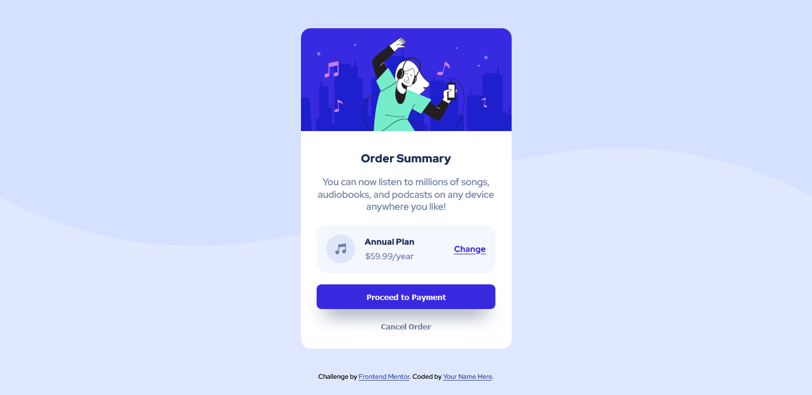

# Frontend Mentor - Order summary card solution

This is a solution to the [Order summary card challenge on Frontend Mentor](https://www.frontendmentor.io/challenges/order-summary-component-QlPmajDUj). Frontend Mentor challenges help you improve your coding skills by building realistic projects. 

## Table of contents

- [Overview](#overview)
  - [The challenge](#the-challenge)
  - [Screenshot](#screenshot)
  - [Links](#links)
- [My process](#my-process)
  - [Built with](#built-with)
  - [What I learned](#what-i-learned)
  - [Useful resources](#useful-resources)
- [Author](#author)


## Overview

### The challenge

Users should be able to:

- See hover states for interactive elements

### Screenshot




### Links

- Solution URL: [Solution URL](https://github.com/najeeb-anwari/order-summary-component-using-flexbox/)
- Live Site URL: [Live View URL](https://your-live-site-url.com)

## My process

### Built with

- Semantic HTML5 markup
- CSS custom properties
- Flexbox
- Mobile-first workflow


### What I learned

Use this section to recap over some of your major learnings while working through this project. Writing these out and providing code samples of areas you want to highlight is a great way to reinforce your own knowledge.

To see how you can add code snippets, see below:

```html
<h1>Some HTML code I'm proud of</h1>
```
```css
.proud-of-this-css {
  color: papayawhip;
}
```
```js
const proudOfThisFunc = () => {
  console.log('🎉')
}
```

### Useful resources

- [CSS Background](https://developer.mozilla.org/en-US/docs/Web/CSS/background) - This helped me for positioning of the backgound image. You can find all related syntax related to the background property here.I really liked the documentation and how it is explained there.
- [Flexbox Froggy](https://flexboxfroggy.com/) - This is an amazing website which helped me review my flexbox skills. I'd recommend it to anyone because it is an interactive game to practice flexbox.


## Author

- Frontend Mentor - [@najeeb-anwari](https://www.frontendmentor.io/profile/najeeb-anwari)
- Github - [@najeeb-anwari](https://github.com/najeeb-anwari)